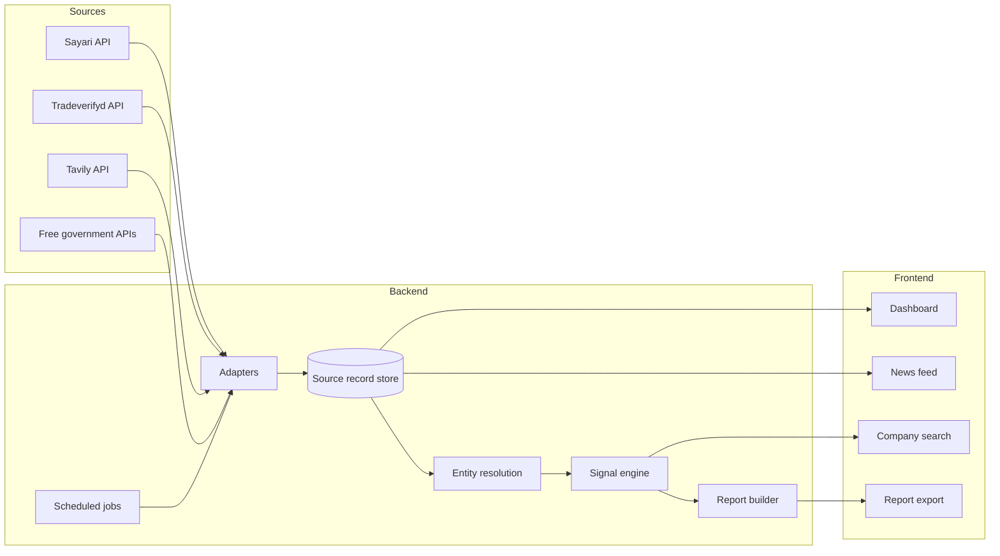

# Follow the Public Dollar — build specification

Working title for a corporate-transparency platform that starts from US federal contract and loan recipients, maps their ownership and supply chains, and surfaces evidence-backed paths to sanctioned or high-risk parties.

This document is the source of truth for the build. It is written so that a developer, or an AI coding assistant in VS Code, can implement it section by section. Where a fact has not been verified, it is marked **[VERIFY]** and must be confirmed against official documentation before code depends on it.

---

## 0. How to use this document

- Build in the order given in section 13. Each milestone is independently demoable.
- Treat section 2 (accuracy principles) as hard requirements. Any feature that cannot meet them ships disabled.
- Never hard-code a vendor endpoint, field name, or score scale from memory. Every external call goes through an adapter (section 5) whose contract is confirmed against the vendor's current docs, with a recorded fixture.
- Items marked **[VERIFY]** are tracked in section 14. Resolve them before the dependent milestone.

---

## 1. Product summary

### 1.1 The question it answers

"Did US federal money reach a company whose owners, officers, or trade partners connect to sanctioned, export-controlled, or otherwise high-risk parties?"

Most due-diligence tools start from a known bad actor and look outward. This tool starts from public money and looks for risk.

### 1.2 Primary users

| User | Their question | What they need |
|---|---|---|
| Regulators, inspectors general, auditors | Did an award recipient connect to risky parties? | An evidence trail where every claim links to a source record |
| Researchers and investigative journalists | Where are the patterns in contract data? | Trends, ranked leads, exportable data |

Secondary users (not in scope for v1): prime-contractor compliance teams, bank KYC teams.

### 1.3 Core features

1. **Dashboard** of trends in federal spending, sanctions and export-control actions, and commodity trade.
2. **News feed** with official government actions and media coverage, each item linked to its source.
3. **Company search** that resolves an entity and shows ownership, network, trade relationships, public-money records, and risk signals.
4. **Report export** as a PDF with full provenance, plus machine-readable evidence files.

### 1.4 Scope boundary for v1

- **In scope:** direct federal money to companies — federal contract awards (USAspending), SAM.gov registrations, PPP and SBA loans.
- **Out of scope:** federal grants passed through state agencies to sub-recipients. The pilot runs (section 3) showed these money paths are not visible in the available data. The UI must say so rather than imply coverage.

---

## 2. Accuracy principles (non-negotiable)

These exist because the users are regulators and researchers who will not accept errors.

1. **Provenance on every fact.** Every value shown in the UI or a report links to a stored source record containing: source name, source record ID, request parameters, retrieval timestamp, and a hash of the raw response.
2. **No generated facts.** The application never writes factual claims that are not a direct rendering of source data. All report prose is built from templates filled with sourced fields. No LLM-generated summaries in v1. If an LLM feature is added later, it must be extractive, cite source records inline, be labeled as machine-generated, and be off by default.
3. **Show uncertainty explicitly.** Entity matches carry a confidence level (section 7). Vendor "possibly same as" flags are displayed as unconfirmed, never as findings.
4. **Timestamps everywhere.** Every panel, profile, and report shows "Data as of" for each source used.
5. **Risk leads, not accusations.** The interface and every report state that outputs are leads for human review, not findings of wrongdoing. Small legitimate firms often look thin online, register in Delaware, or use registered agents.
6. **Multiple signals required.** No single signal can place an entity in the High tier (section 9.3).
7. **Absence is not innocence.** A missing flag is shown as "no record found in [source] as of [date]", never as "clean". The pilot showed a convicted organization carrying no enforcement flag.
8. **Human in the loop.** Analysts can confirm or dismiss each lead with a note. Dismissals are logged, never deleted.
9. **Reproducibility.** Any report can be regenerated from stored source records, and each report carries a content hash.
10. **Licensing respected.** Exported reports include only data the vendor licenses permit redistributing **[VERIFY]**.

---

## 3. What the pilot runs showed

Two test runs through the actual Sayari, Tradeverifyd, and Tavily tools shaped this spec. Keep these as regression fixtures (appendix A).

### 3.1 Sayari already holds public-money data

Sayari's source catalog for the US includes USAspending.gov contract profiles, SAM.gov entity registrations, SAM.gov exclusions, PPP loan recipients, SBA 504/7(a) loans, the SBA Dynamic Small Business Database, IRS 990 filings, the DLA CAGE registry, OFAC SDN and non-SDN lists, the BIS Entity List, the UFLPA Entity List, and state company registries. This means much of the public-money layer can be reached through Sayari, cross-checked against the free government APIs in section 5.4.

### 3.2 Case 1: AZ Gold (sanctioned UAE company, backward test)

- One company appeared as **four separate Sayari records**. Only one carried the sanction. The others carried "possibly same as" flags. **Lesson:** entity resolution must merge on shared identifiers before scoring.
- One hop from the shared manager returned five OFAC-designated sibling companies and one company not on the US SDN list. **Lesson:** officer and manager pivots are high-value.
- Tradeverifyd did not index AZ Gold, but it did surface two prior names for a sibling company. **Lesson:** coverage differs by vendor, so query all of them.
- Tradeverifyd name search returned many irrelevant low-relevance matches. **Lesson:** calibrate a confidence cutoff on labeled data rather than assuming one.
- Neither vendor showed trade records, although the core allegation involved gold moving from Sudan to Dubai. **Lesson:** trade-based signals will be silent for informal flows, and the UI must say "no trade data available", not "no trade risk".
- The SAM.gov record for AZ Gold came from the **Exclusions** database, not registrations. **Lesson:** always display which SAM dataset a record comes from.

### 3.3 Case 2: Feeding Our Future (pandemic fraud, forward test)

- The convicted nonprofit carried **no enforcement flag** and was listed as active in the state registry.
- The federal money moved through a state agency, so no award record attached to the recipient.
- The shell sites connected to the nonprofit through sponsorship agreements, which company registries do not record.
- Person records were fragmented, so pivoting on individuals returned only one company each.
- The name matched unrelated organizations in several states and countries. "Safari Restaurant" returned 296 matches. **Lesson:** never match on name alone.
- One site company showed a clear lifecycle pattern: registered within weeks of the program waivers opening, now inactive.

---

## 4. Architecture

### 4.1 Stack

| Layer | Choice | Reason |
|---|---|---|
| Frontend | Next.js (App Router) with TypeScript | Server-rendered pages, good table and graph libraries |
| Styling | Tailwind CSS with the tokens in section 10 | Enforces a consistent design system |
| Graph view | Cytoscape.js | Handles ownership and trade networks of a few hundred nodes |
| Charts | Recharts | Simple time-series and bar charts for the dashboard |
| Tables | TanStack Table | Sorting, filtering, and column control for dense data |
| Backend API | Python 3.12, FastAPI, Pydantic v2 | Typed request and response models, async HTTP |
| HTTP client | httpx with retry and backoff | Consistent error handling across vendors |
| Database | PostgreSQL | Source records, entities, signals, reports, audit log |
| Cache and jobs | Redis, with a scheduler for news and dashboard refresh | Rate-limit protection and background refresh |
| PDF reports | HTML templates rendered with WeasyPrint | Precise print layout, footnotes, page numbers |
| Local dev | Docker Compose | One command brings up all services |

### 4.2 System diagram



### 4.3 Repository layout

```
/apps
  /web                 Next.js frontend
    /app
      /dashboard
      /news
      /entities/[id]
      /reports/[id]
    /components
    /lib/api.ts        Typed client for the backend
  /api                 FastAPI backend
    /adapters          One module per external source
      sayari.py
      tradeverifyd.py
      tavily.py
      usaspending.py
      sam.py
      federal_register.py
      ofac.py
      gleif.py
      opensanctions.py
      companies_house.py
    /core
      resolution.py    Entity resolution and merging
      signals/         One module per signal family
      scoring.py       Tier assignment rules
      provenance.py    Source record storage and hashing
    /reports
      templates/       Jinja2 HTML templates for PDF
      builder.py
    /jobs              Scheduled refresh tasks
    /models            SQLAlchemy models
    /routes            FastAPI routers
/config
  signals.yaml         Signal weights and thresholds
  news_topics.yaml     News queries and typology keyword rules
  sources.yaml         Source metadata and refresh intervals
/fixtures              Recorded API responses for tests and offline demo
/tests
/docs
docker-compose.yml
.env.example
```

---

## 5. Data sources and adapters

### 5.1 Adapter contract

Every adapter implements the same interface so that vendors can be swapped or mocked.

```python
class SourceAdapter(Protocol):
    source_name: str

    async def call(self, operation: str, params: dict) -> SourceRecord:
        """Performs one request, stores the raw response as a SourceRecord,
        and returns it. Never returns unstored data."""

class SourceRecord(BaseModel):
    id: UUID
    source_name: str            # e.g. "sayari"
    operation: str              # e.g. "entity_profile"
    request_params: dict
    retrieved_at: datetime      # UTC
    http_status: int
    response_hash: str          # SHA-256 of raw body
    raw_response: dict | list   # stored verbatim
    vendor_record_ids: list[str]
    license_tag: str            # governs redistribution in reports
```

Rules for all adapters:

- API keys load from environment variables on the server only. They never reach the browser.
- Every raw response is stored before it is parsed.
- Replay mode: with `REPLAY_MODE=true`, adapters serve stored responses for matching requests. This keeps the demo working if rate limits or Wi-Fi fail during judging.
- Errors are surfaced to the UI as "Source unavailable: [source], [time]", never silently dropped.
- Rate limits, pagination, and retry behavior come from vendor docs **[VERIFY]**.

### 5.2 Licensed sources

The capabilities below were confirmed to exist through each vendor's Claude connector. The REST endpoint for each capability must be mapped from the vendor's own API documentation **[VERIFY]**. Do not assume the connector tool names match REST paths.

**Sayari** (ownership, risk, public-money records, trade)

| Capability | Used for |
|---|---|
| Entity search | Resolving a company name or identifier to candidate records |
| Entity profile | Names, addresses, identifiers, registration date, status, relationships, risk factors, sources |
| Beneficial owners | Ownership chains, including chains that end at a company instead of a person |
| Watchlist screening | Paths to sanctioned parties, PEPs, and regulatory actions |
| Network traversal | Officers, shareholders, linked entities at 1 to 3 hops |
| Upstream supply chain and shipment search | Supplier tiers and trade records |
| Record retrieval | Original source documents for the evidence trail |
| Risk factor definitions | Explaining what each Sayari risk flag means |
| Data source catalog | Showing users which registries back a record |

**Tradeverifyd** (trade relationships and annotations)

| Capability | Used for |
|---|---|
| Entity search | Candidate matches with a confidence value, aliases, and prior names |
| Entity details and addresses | Cross-checking identity |
| Entity annotations | Sanctions and other flags applied by Tradeverifyd |
| Entity score | The Tradeverifyd Score, shown alongside other evidence |
| Trade relationships | Suppliers and customers, with HS codes per relationship |
| Annotated relationship paths | Paths from an entity to flagged entities in its supply chain |
| Find companies in radius | Detecting clusters of companies at one address |
| HS trends | Commodity import trends for the dashboard |
| Disruptions | Active disaster and weather events for the dashboard |

**Tavily** (web presence and news)

| Capability | Used for |
|---|---|
| Search | Web-presence checks and media news for the feed |
| Extract | Pulling the text of a specific page cited as evidence |

### 5.3 Vendor-specific handling

- **Sayari "possibly same as" flags** (prefixed `psa_` in the pilot data) mean a possibly-same record carries that risk. Display them as unconfirmed. They cannot on their own satisfy the sanctions-proximity signal.
- **Sayari risk flags** are displayed with the definition returned by the risk-factor lookup, not a paraphrase.
- **Tradeverifyd Score** is displayed as reported, with its version and level. Do not rescale or combine it with other scores until the vendor documents its scale and method **[VERIFY]**.
- **Tavily results** are shown as links with publisher, title, and date. Page text is quoted only via the extract capability and only in short excerpts, respecting copyright.

### 5.4 Free public sources

| Source | What it adds | Access |
|---|---|---|
| USAspending.gov API | Contract awards, recipients, subawards, awarding agencies | Free, no key, REST API at api.usaspending.gov |
| SAM.gov Entity Management API | Registrations (UEI, registration date, business types) | Free API key via api.data.gov **[VERIFY current API version]** |
| SAM.gov Exclusions | Debarred and excluded parties | Same key, separate dataset |
| Federal Register API | Official rules and notices, including BIS Entity List and UFLPA updates | Free, no key |
| OFAC Sanctions List Service | SDN and consolidated lists, official downloads | Free **[VERIFY download URLs and formats]** |
| GLEIF API | LEI records and parent-child relationships | Free, no key |
| OpenSanctions | Aggregated sanctions and PEP data for cross-checking | Check license terms for your use case **[VERIFY]** |
| UK Companies House API | Officers and persons with significant control | Free API key |

The government sources serve two jobs: they are the official record against which vendor flags are cross-checked, and they power the dashboard and the official lane of the news feed.

---

## 6. Data model

Core tables (PostgreSQL). Field lists are the minimum.

| Table | Key fields |
|---|---|
| `source_records` | As in section 5.1 |
| `entities` | id, canonical_name, type (company, person, vessel), jurisdiction, created_at |
| `entity_identifiers` | entity_id, scheme (UEI, CAGE, LEI, OFAC SDN number, state filing number, vendor ID), value, source_record_id |
| `entity_members` | entity_id, vendor, vendor_entity_id, match_level, match_reasons, source_record_id |
| `relationships` | from_entity, to_entity, type (owner, officer, linked, supplier, customer, affiliate), is_former, percentage, hs_codes, source_record_id |
| `public_money_records` | entity_id, program (contract, PPP, SBA loan), amount, date, awarding_agency, award_id, source_record_id |
| `signals` | entity_id, signal_code, fired (bool, or null if data unavailable), evidence (json), source_record_ids, computed_at |
| `assessments` | entity_id, tier, signal_families_fired, config_version, computed_at |
| `analyst_reviews` | assessment_id, analyst, decision (confirmed, dismissed, needs_info), note, created_at |
| `news_items` | lane (official, media), source, publisher, title, url, published_at, retrieved_at, matched_rules, source_record_id |
| `reports` | id, entity_id, created_by, created_at, content_hash, config_version, source_record_ids |

A signal with no data available stores `fired = null` and is shown as "not assessable", distinct from "not fired".

---

## 7. Entity resolution

The pilot showed that fragmented and look-alike records are the main way these tools produce wrong answers. Resolution rules:

### 7.1 Match levels

| Level | Rule | Behavior |
|---|---|---|
| Confirmed | Share at least one strong identifier: UEI, CAGE, LEI, OFAC SDN number, or official registration number in the same jurisdiction | Auto-merge into one entity |
| Probable | Normalized name and full address match, same jurisdiction, no conflicting identifiers | Shown grouped, merge requires analyst confirmation |
| Possible | Normalized name and jurisdiction match only | Shown as a separate candidate, never merged automatically |
| Unmatched | Anything else | Not linked |

- Name normalization handles legal suffixes (L.L.C., LLC, Ltd), punctuation, "&" versus "and", and transliteration variants. It never lowers the match level on its own.
- Conflicting strong identifiers block a merge, whatever the name similarity.
- Every merge records its reasons and the source records behind them, visible in the UI.
- Vendor confidence values (such as Tradeverifyd's) are shown but not used as the sole merge basis. Any cutoff is set by testing on the fixtures in appendix A.

### 7.2 Search flow

1. User enters a name, UEI, CAGE, LEI, or registration number.
2. Identifier searches go straight to exact lookup.
3. Name searches return a candidate list with jurisdiction, identifiers, address, and match level, grouped by probable entity.
4. The user picks the entity. The app never auto-selects the first name hit.

---

## 8. Features

### 8.1 Dashboard

Purpose: general trends for researchers and regulators. Every panel shows its source and "Data as of".

| Panel | Content | Source |
|---|---|---|
| Federal spending in watched sectors | Contract obligations over time for configured NAICS or PSC codes (for example battery and critical-mineral sectors) | USAspending API |
| Sanctions and export-control actions | Timeline of official notices by agency and program | Federal Register API, OFAC list data |
| Commodity trade inflections | HS codes whose US import trend is changing | Tradeverifyd HS trends |
| Active supply-chain disruptions | Current disaster and severe weather events | Tradeverifyd disruptions |
| Screening portfolio | Tier distribution and recent changes for entities the team has screened | Application database |
| Newly flagged award recipients | Screened recipients whose tier rose since the last run | Application database |

Behavior:

- Filters for date range, agency, sector, and typology apply across panels.
- Clicking a chart point opens the underlying records in a table with source links.
- Panels load independently. A failed source shows an error state in its own panel only.

### 8.2 News feed

Two separate lanes, never mixed, because regulators weigh them differently.

**Official actions lane**
- Federal Register documents from Treasury, Commerce (BIS), DHS, and other configured agencies, filtered by topic.
- OFAC list changes, detected by comparing successive official list downloads.
- Each item shows agency, document type, title, publication date, and a link to the official document.

**Media and research lane**
- Tavily news searches on topics in `config/news_topics.yaml` (for example sanctions evasion, export controls, UFLPA, federal contract fraud).
- Optional publisher allowlist, configurable by the team.
- Each item shows publisher, title, date, and link. No rewriting or summarizing of the article.

Shared behavior:

- Items are tagged by typology using deterministic keyword rules in config. The UI shows which rule matched.
- Deduplication by canonical URL and title similarity.
- If an item mentions an entity the team has screened, it links to that entity, but only when the mention matches at the Confirmed or Probable level.
- Refresh runs on a schedule. "Live" in the UI means "refreshed at [time]", shown on the page.

### 8.3 Company search and supply chain view

Entity page sections, in this order:

1. **Identity.** Canonical name, all names and prior names, identifiers, jurisdictions, addresses, registration date, status, and the list of merged source records with match levels.
2. **Public money.** Contract awards, SAM registration (with dataset clearly labeled: registration or exclusion), PPP and SBA loans. Amounts, dates, agencies, award IDs, each linked to the official record.
3. **Risk summary.** Tier, signal families fired, each signal with evidence and sources, plus signals not assessable and why. The "risk lead, not accusation" notice sits here.
4. **Ownership.** Beneficial-owner chains with percentages where reported. Chains ending at a legal person are marked.
5. **Network.** Officers, shareholders, and linked entities at 1 to 3 hops, in a graph and an equivalent table. Flagged nodes are marked by shape and label as well as color.
6. **Supply chain.** Suppliers and customers by tier, with HS codes, from Sayari and Tradeverifyd shown side by side with their sources. Where no trade data exists, the section says so.
7. **Paths to flagged parties.** Ranked list of paths from the entity to sanctioned or listed parties, each hop linked to its source record.
8. **Web presence.** Tavily results grouped into official sites, registry or aggregator listings, and media coverage.
9. **Analyst review.** Confirm, dismiss, or request information, with a note.

Performance: sections load progressively. The page shows which sources have responded and which are pending.

### 8.4 Report export

Formats:

- **PDF report** for reading and filing.
- **JSON evidence bundle** containing every source record used.
- **CSV files** of entities, relationships, and signals.

PDF structure:

1. Cover page: entity name, identifiers, report ID, generation time, content hash, and the risk-lead notice.
2. Summary table: tier, signal families fired, key public-money records. Built from templates only.
3. Identity and match reasoning.
4. Public-money records.
5. Signals, each with evidence and footnoted sources.
6. Ownership and network diagrams, with equivalent tables.
7. Supply chain tables.
8. Paths to flagged parties.
9. Sources appendix: every source record with source, record ID, retrieval time, and link.
10. Methodology and limitations: signal definitions, config version, data coverage gaps (including pass-through grants and informal trade), and data-as-of dates.

Rules:

- The report is generated only from stored source records and is reproducible from them.
- Analyst review status and notes appear if present.
- Content from sources that do not permit redistribution is replaced by a reference to the source record **[VERIFY licensing]**.

---

## 9. Signal framework and scoring

### 9.1 Signal families

Every signal stores: fired, not fired, or not assessable, plus its evidence and source record IDs. Weights and thresholds live in `config/signals.yaml` and are marked provisional until calibrated (section 12).

**Public money**

| Code | Red flag | Data |
|---|---|---|
| PM1 Registration-to-award gap | Registered in SAM.gov shortly before a large award | SAM.gov, USAspending |
| PM2 Award size versus profile | Award far exceeds what a firm of that age and size typically delivers | SAM.gov, USAspending |
| PM3 Non-competitive award | Sole-source award to a young or thin company | USAspending |
| PM4 Pass-through | Prime passes most of the award to subawardees | USAspending subawards |
| PM5 Shared principals across bidders | Same officers or addresses behind competing firms | Sayari, Companies House |
| PM6 Excluded party | Entity or a Confirmed match appears in SAM.gov Exclusions | SAM.gov |

**Structure**

| Code | Red flag | Data |
|---|---|---|
| ST1 UBO dead end | Ownership chain ends at a legal person, not a natural person | Sayari |
| ST2 Layered or circular ownership | Several holding layers, or a loop | Sayari |
| ST3 Officer concentration | Officer or manager linked to many unrelated companies | Sayari, Companies House |
| ST4 Secrecy jurisdiction | Entity or owner in a configured list of jurisdictions | Sayari, config |

**Lifecycle**

| Code | Red flag | Data |
|---|---|---|
| LC1 Recent incorporation then activity | Registered shortly before significant awards or trade | Sayari, SAM.gov, USAspending |
| LC2 Program-timing registration | Registered shortly after a funding program opened | Sayari, program dates in config |
| LC3 Rename history | One or more prior names | Tradeverifyd, Sayari |
| LC4 Phoenix pattern | New entity shares officers, owners, or addresses with a closed, previously flagged entity | Sayari, application database |

The "shells close within about two years" figure from the brainstorm is not used until a source is found. LC4 works without it.

**Location**

| Code | Red flag | Data |
|---|---|---|
| LO1 Address cluster | Unusually many companies at one registered address | Tradeverifyd, Sayari |
| LO2 Virtual office | Address belongs to a mailbox or coworking provider | Tavily, analyst confirmation |

**Trade**

| Code | Red flag | Data |
|---|---|---|
| TR1 Business-goods mismatch | Declared business does not match shipped goods | Sayari, Tradeverifyd |
| TR2 High-priority goods | HS codes on the multilateral Common High Priority List **[VERIFY current list]** | Sayari, Tradeverifyd |
| TR3 Transshipment routing | Goods pass through configured hubs | Sayari, Tradeverifyd |
| TR4 Partner churn | Abrupt changes in trade counterparties | Sayari, Tradeverifyd |

**Presence**

| Code | Red flag | Data |
|---|---|---|
| PR1 No footprint | No company website or media, only registry or aggregator listings | Tavily |
| PR2 Adverse media | Enforcement or investigative coverage | Tavily, Sayari adverse media |

**Proximity**

| Code | Red flag | Data |
|---|---|---|
| PX1 Listed entity | Entity is itself on an official list (Confirmed match only) | Sayari, OFAC, BIS, UFLPA |
| PX2 Sanctions proximity | Listed party within 1 to 3 hops, weighted by distance | Sayari, Tradeverifyd |
| PX3 OFAC 50% rule | Listed parties together own 50% or more | Sayari ownership percentages |

### 9.2 Evidence requirements

- A signal can fire only with at least one stored source record as evidence.
- PX1 and PX2 require the listed party to match at the Confirmed level. "Possibly same as" flags produce a separate, visible note, not a firing signal.
- PR1 requires that the Tavily search was actually run and returned results. A failed search makes PR1 not assessable.

### 9.3 Tiers

| Tier | Rule (provisional) |
|---|---|
| High | Signals fired in at least two different families, and at least one is in Proximity or PM6 |
| Elevated | Signals fired in at least two different families, none in Proximity |
| Low | Zero or one family fired |
| Not assessable | Resolution below Probable, or core sources unavailable |

- Proximity and trade mismatch carry the highest weights, because they are the hardest to explain innocently.
- The display always lists the signals that fired. The tier never appears without them.
- Config changes create a new config version. Assessments record the version used.

### 9.4 Cross-vendor risk index

The brainstorm proposed an index combining Sayari risk and Tradeverifyd. Approach for v1:

- Show Sayari risk flags and the Tradeverifyd Score side by side, each labeled with its source and method.
- The application's own tier comes only from the transparent signals above.
- A combined numeric index is deferred until both vendors' scoring methods and scales are documented **[VERIFY]**, and until it has been calibrated on the backtest set.

---

## 10. Interface design

### 10.1 Direction

The subject is public spending and official records, so the design takes its cues from government audit documents: dense, legible tables, restrained color, and color reserved for meaning. The one memorable element is the **money trail**: a horizontal strip on each entity page that traces the path from the federal award to the flagged party, one hop per step, each step clickable to its source record.

### 10.2 Tokens

| Token | Value | Use |
|---|---|---|
| `ink` | `#1B2A41` | Primary text and headings |
| `slate` | `#51607A` | Secondary text |
| `paper` | `#FFFFFF` | Page background |
| `rule` | `#D5DBE3` | Borders and table lines |
| `ledger` | `#1E5B4F` | Public-money elements and primary actions |
| `elevated` | `#9A6A12` | Elevated tier |
| `high` | `#8E2A2A` | High tier |
| `unconfirmed` | `#6B6F76` | "Possibly same as" and not-assessable states |

- Typeface: Public Sans for the interface (the typeface of the US Web Design System, which suits government-record subject matter) and Source Serif 4 for PDF report body text. Tabular figures for all numbers.
- Tier is never conveyed by color alone. Each tier has a text label and a distinct marker shape.
- Contrast meets WCAG 2.1 AA.

### 10.3 Layout

```
+------------+--------------------------------------------------+
| Dashboard  |  Entity name                    Tier: Elevated    |
| News       |  UEI ...  CAGE ...  Data as of ...                |
| Search     |--------------------------------------------------|
| Reports    |  Money trail:  Award -> Company -> Owner -> Listed |
|            |--------------------------------------------------|
|            |  Identity | Public money | Risk | Ownership | ... |
|            |  [dense table or graph for the selected section]  |
+------------+--------------------------------------------------+
```

- Left navigation rail, content left-aligned.
- Sentence case throughout. No all-caps labels.
- Motion only in response to user actions, such as expanding a path.
- Keyboard navigation and visible focus states on every control.

### 10.4 Copy

- Plain, specific labels: "Download report", "Confirm lead", "Dismiss lead".
- Empty and error states say what happened and what to do next. For example: "Tradeverifyd did not return a match for this company. Trade relationships may be missing."
- The risk-lead notice reads: "This is a risk lead for human review, not a finding of wrongdoing. Every item links to its source."

---

## 11. Security and compliance

- API keys stored as server-side environment variables. `.env` is git-ignored, `.env.example` lists names only.
- User authentication for the web app, with per-user audit logs of searches, reviews, and report exports.
- Data covers companies and their officers as recorded in public registries and licensed datasets. Do not add personal data beyond what sources provide.
- Respect each vendor's terms on storage, caching duration, and redistribution **[VERIFY]**.
- HTTPS only in deployment. No keys or vendor data in client-side bundles.

---

## 12. Testing and validation

### 12.1 Automated tests

- Adapter tests against recorded fixtures for every operation.
- Entity resolution tests using appendix A: the four AZ Gold records must merge only where identifiers support it, and the unrelated "Feeding Our Future" organizations must never merge.
- Signal tests: each signal fires, does not fire, or returns not assessable on constructed fixtures.
- Report tests: reports regenerate identically from the same source records (same content hash).

### 12.2 Backtest

Primary typology: federal contractors and sanctions.

1. Assemble a validation set of entities with documented enforcement: SAM.gov exclusions tied to sanctions or export-control actions, and OFAC or BIS designations of entities with prior federal registrations or awards. The specific cases must be selected from official records **[VERIFY: no case has been selected yet]**.
2. For each case, run the pipeline using only data dated before the enforcement action where timestamps allow.
3. Report how many would have reached High or Elevated, and how early.
4. AZ Gold (appendix A) serves as a sanctions-network fixture, but not as a public-money backtest, since its SAM record is an exclusion only.

### 12.3 False-positive study

- Draw a random sample of 50 to 100 ordinary contract recipients from USAspending.
- Run the full pipeline and report the share reaching each tier.
- Review every High result by hand and publish the results in the methodology section.

### 12.4 Calibration

Signal weights and the vendor match cutoff are tuned on the backtest and false-positive sets, never on intuition. The calibration results are recorded with the config version.

---

## 13. Build plan

| Milestone | Deliverable | Done when |
|---|---|---|
| M0 Setup | Repo, Docker Compose, database migrations, env config | `docker compose up` runs all services |
| M1 Adapters | Sayari, Tradeverifyd, Tavily, USAspending, SAM.gov adapters with source-record storage and replay mode | Fixture tests pass for every operation |
| M2 Resolution | Match levels, merging, candidate search UI | Appendix A resolution tests pass |
| M3 Entity page | Identity, public money, ownership, network, supply chain sections | AZ Gold fixture renders fully with sources |
| M4 Signals | Signal engine, tiers, risk summary, money trail | Signal tests pass, tiers show evidence |
| M5 Reports | PDF, JSON, and CSV export | Report regenerates with identical hash |
| M6 News feed | Official and media lanes, typology tagging | Both lanes refresh on schedule with sources |
| M7 Dashboard | Panels in section 8.1 | Every panel shows source and data-as-of |
| M8 Validation | Backtest and false-positive results in the methodology page | Results published in the app |

Demo path for judging: pick one federal contractor, show its award, resolve it, walk the money trail to any flagged party, show the signals with evidence, and download the report. Run the demo in replay mode.

---

## 14. Open items

| Item | Needed by |
|---|---|
| Obtain Tradeverifyd REST API docs (backlog B1 in `docs/data-source-map.md`). Until then, Tradeverifyd features stay disabled | M1 for Tradeverifyd adapters |
| Map each vendor capability in section 5.2 to its REST endpoint, auth method, rate limits, and pagination | M1 |
| Confirm the current SAM.gov Entity Management API version and OFAC list download formats | M1 |
| Confirm the Tradeverifyd Score scale and method, and the meaning of each Sayari risk flag prefix | M4 |
| Confirm vendor licensing terms for caching and for including data in exported reports | M5 |
| Confirm the current Common High Priority List HS codes | M4 |
| Select backtest cases from official enforcement records | M8 |
| Find a source for the "shells close within about two years" figure, or keep it out | Before pitch |
| Confirm the current status of the US Corporate Transparency Act and UK Companies House identity verification before citing them | Before pitch |
| Decide the configured NAICS or PSC codes for the dashboard's watched sectors | M7 |

---

## Appendix A: pilot fixtures

These IDs come from the pilot runs through the Sayari and Tradeverifyd connectors on 25 September 2026. Record fresh API responses for them in `/fixtures` at M1, since data may have changed.

### A.1 AZ Gold network (Sayari entity IDs)

| Entity | Sayari ID | Notes from pilot |
|---|---|---|
| Al Zumoroud and Al Yaqoot Gold & Jewellers Trading L.L.C. | `RoWARA0BHg-GoWvDJFBOSg` | OFAC SDN; registration date 2020-02-20; no trade records |
| Same name, SAM.gov record | `5_HddMOMZhSHxWUT05LMKA` | Source: SAM.gov Exclusions; carries "possibly same as" flags only |
| Same name, SAM.gov record | `_SIwEh3f1L3ez2dHdtMADQ` | SAM UEI identifier; "possibly same as" flags only |
| Same name, UAE registry record | `JpVf25RrEuLqHVqxnsWSig` | Shares registration number 1708681 with the sanctioned record |
| Abu Dharr Abdul Nabi Habiballa Ahmmed | `sAgA0QVKr-gjEAqoJvf0zg` | OFAC SDN; one hop to the sibling companies below |
| Capital Tap Holding L.L.C. | `l-hTG9hSLd7dA4za2B7CRw` | OFAC SDN |
| Capital Tap General Trading L.L.C. | `XtartWzEze9a18ZDKVad8A` | OFAC SDN; two prior names in Tradeverifyd |
| Creative Python L.L.C. | `GpzoSlwJiKSXyY0Rl51-6w` | OFAC SDN |
| Al Jil Alqadem General Trading L.L.C. | `Aq8D2ZKjaHPMSp7ZQdQ3-w` | OFAC SDN |
| Prodigious Real Estate Management Supervision Services | `dFB7YowXog_6EwiEur43RQ` | Not on US SDN list; single third-party source; "possibly same as" UK-listed record; use as the unconfirmed-lead test |

Expected resolution result: `RoWARA0BHg-GoWvDJFBOSg` and `JpVf25RrEuLqHVqxnsWSig` merge at Confirmed (shared registration number). The two SAM records remain Probable unless a shared strong identifier is found.

### A.2 Feeding Our Future (Sayari entity IDs)

| Entity | Sayari ID | Notes from pilot |
|---|---|---|
| Feeding Our Future (Minnesota nonprofit) | `S2sKpLjtsHqnJMTy6mwuTw` | Only Minnesota registry data; no enforcement flag; status active |
| Empire Cuisine And Market LLC | `DtI-nSSPD00ZgUxoSFxKuA` | Registered 2020-04-01; inactive; law-enforcement flag |
| Unrelated same-name organizations | `EIO1Rxgq6ezyZVW2-sxPhw`, `D-bTb1c6BNxP7FQ5o7lEkw`, `AWuTtca4O_lvFemdqKteeA`, `FjE5JBGCPicBhwRFOYRX4A`, `g4t3FFj3iCHXClnYPY-tiA` | Must never merge with the Minnesota entity |

This case is out of scope for public-money detection (pass-through grant) and serves as a resolution and false-positive fixture.

---

## Appendix B: glossary

| Term | Meaning |
|---|---|
| UEI | Unique Entity ID, the identifier SAM.gov assigns to registered entities |
| CAGE | Commercial and Government Entity code, assigned for defense procurement |
| LEI | Legal Entity Identifier, a global company identifier |
| SDN | OFAC's Specially Designated Nationals and Blocked Persons List |
| UBO | Ultimate beneficial owner, the natural person who ultimately owns or controls a company |
| OFAC 50% rule | Entities owned 50% or more, in total, by blocked persons are themselves treated as blocked |
| Pass-through grant | Federal funds given to a state or other body, which then passes them to sub-recipients |
| Risk lead | A pattern worth human review, not a finding of wrongdoing |
